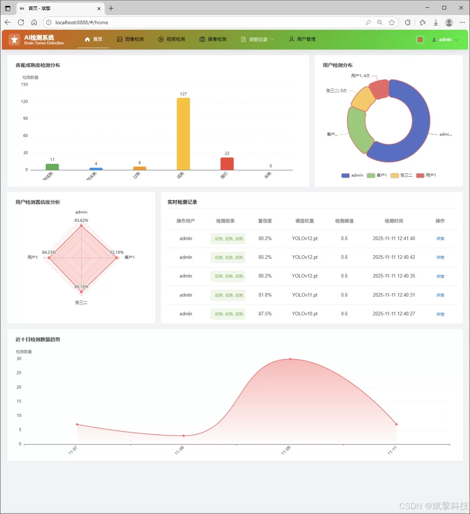
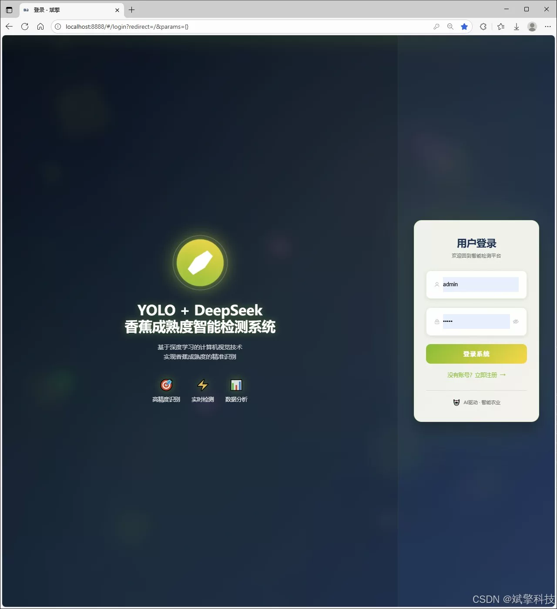
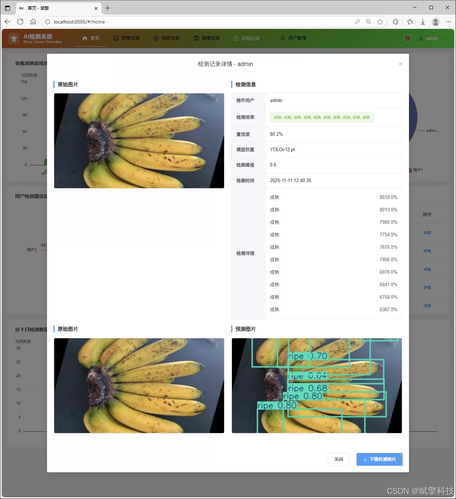
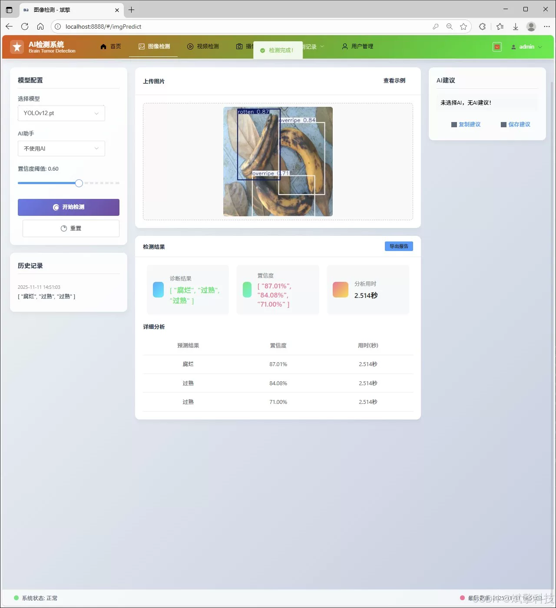
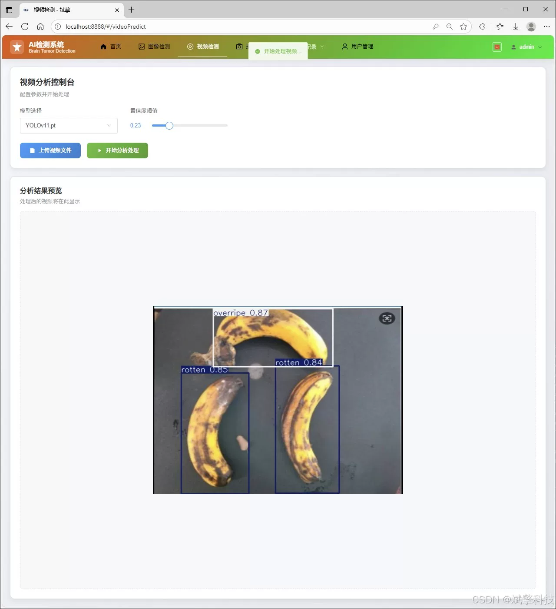
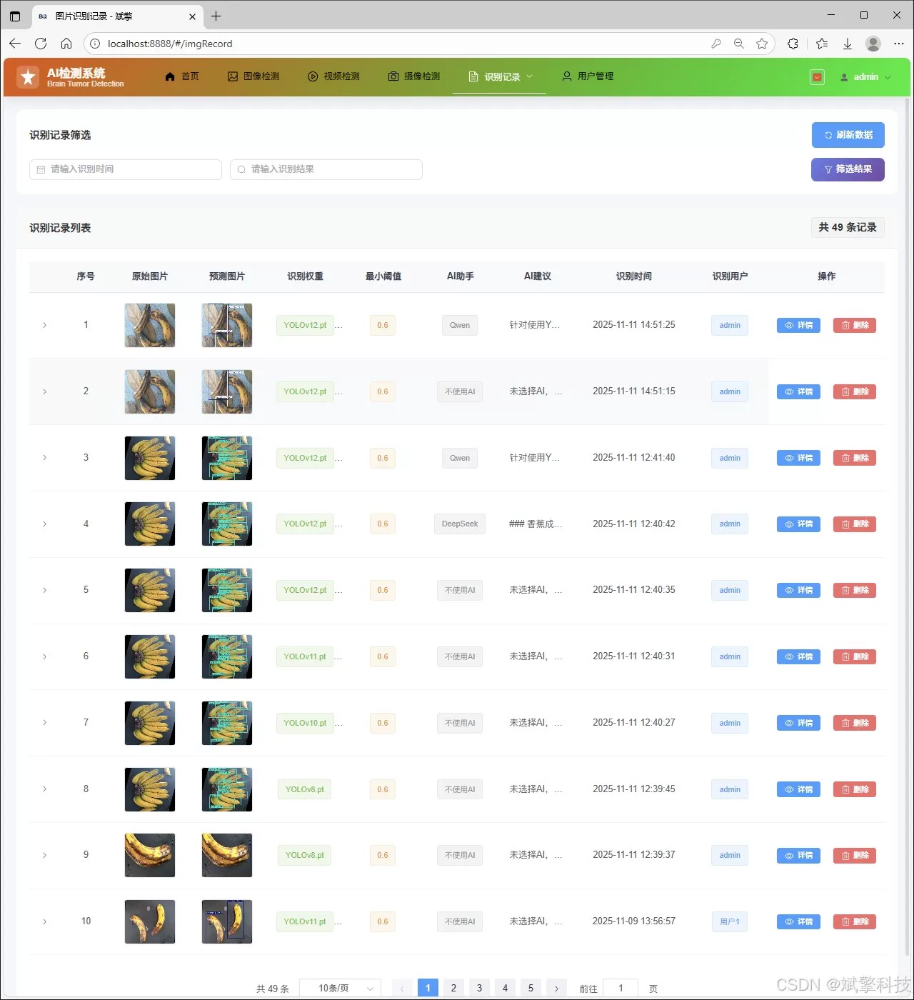
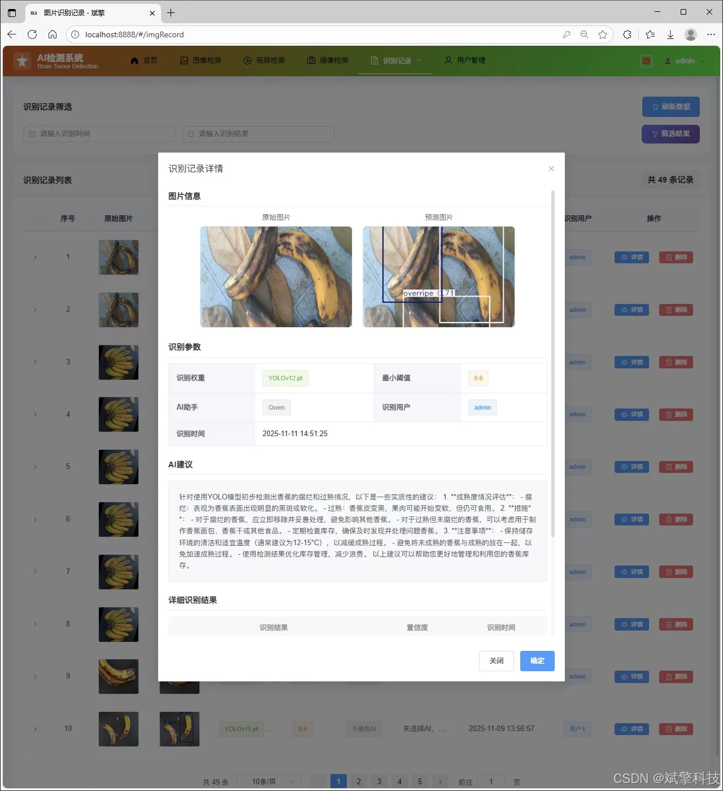
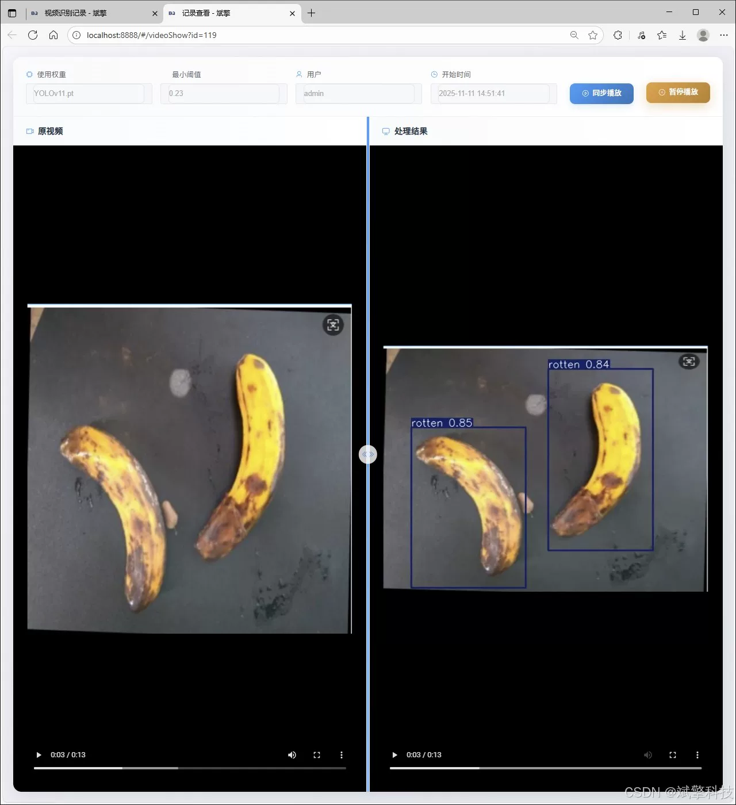
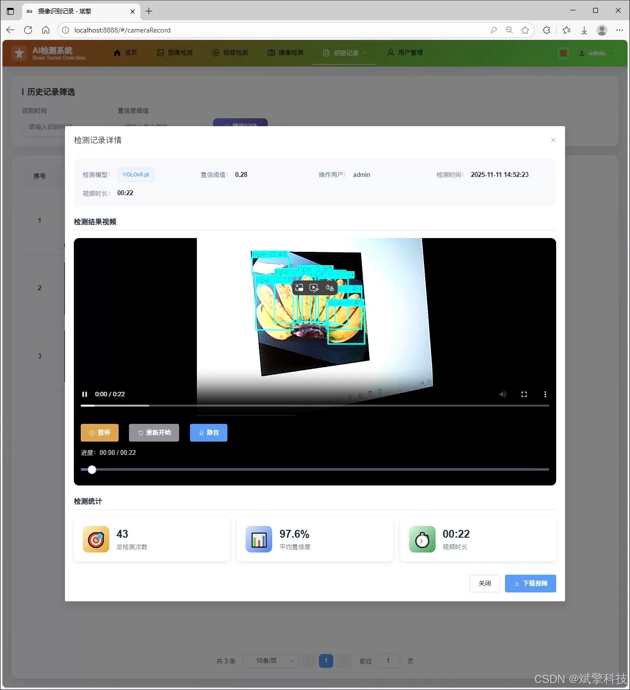

# YOLO banana ripeness detection system

## Body

The YOLO banana ripeness detection system is based on the YOLO deep learning and the big models of Qianwen and DeepSeek. The banana ripeness recognition detection system (DeepSeek intelligent analysis + web interaction interface + front-end separation + YOLO data + YOLOv8/YOLOv10/YOLOv11/YOLOv12)

The project aims to design and implement a banana ripeness intelligent recognition and detection system based on deep learning and Web technology. The core of the system adopts the cutting-edge YOLO series object detection models (including YOLOv8, v10, v11, v12), which achieve rapid and accurate classification of banana image ripeness. The backend uses the SpringBoot framework to build a RESTful API, with frontend and backend separated, providing a friendly web interaction interface. The system integrates complete functions such as user authentication, multi-model switching, various detection modes (image, video, real-time camera), detection record management, data visualization, and an administrator's back end. By combining AI analysis capabilities like DeepSeek, this system is not only an efficient computer vision application but also a comprehensive and scalable intelligent agricultural management platform.

Functional module

✅ Information Visualization, Data Visualization.

✅ Image detection supports AI analysis functions, deepseek and Qianwen.

✅ Supports image detection, video detection, and real-time camera detection. The results are saved to a MySQL database.

✅ Picture recognition record management, video recognition record management and camera recognition record management.

✅ User Management Module, administrators can add, delete, modify, and query users.

✅ Personal center, can modify their own information, password name profile picture and so on.

There is no Lunwen writing service, nor any Lunwen.

## Images

## Payment

Here is a pay link on Stripe ( https://buy.stripe.com/3cs8yP7sY87d0vu9AB ). Please contact me lonlonago@foxmail.com after funding $89, and I will send you a complete data files , thank you!

